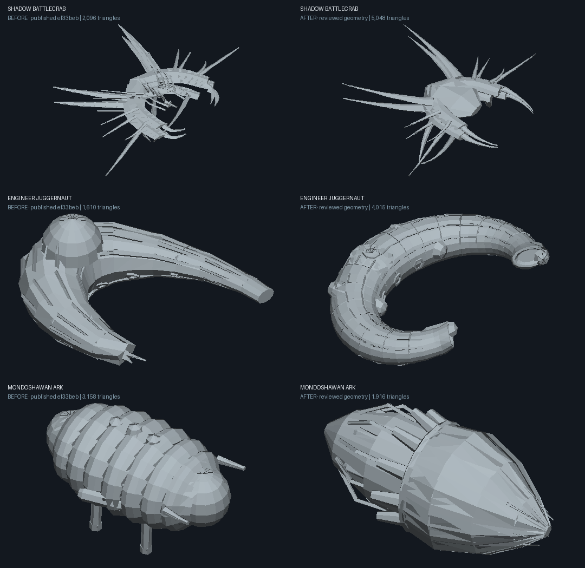
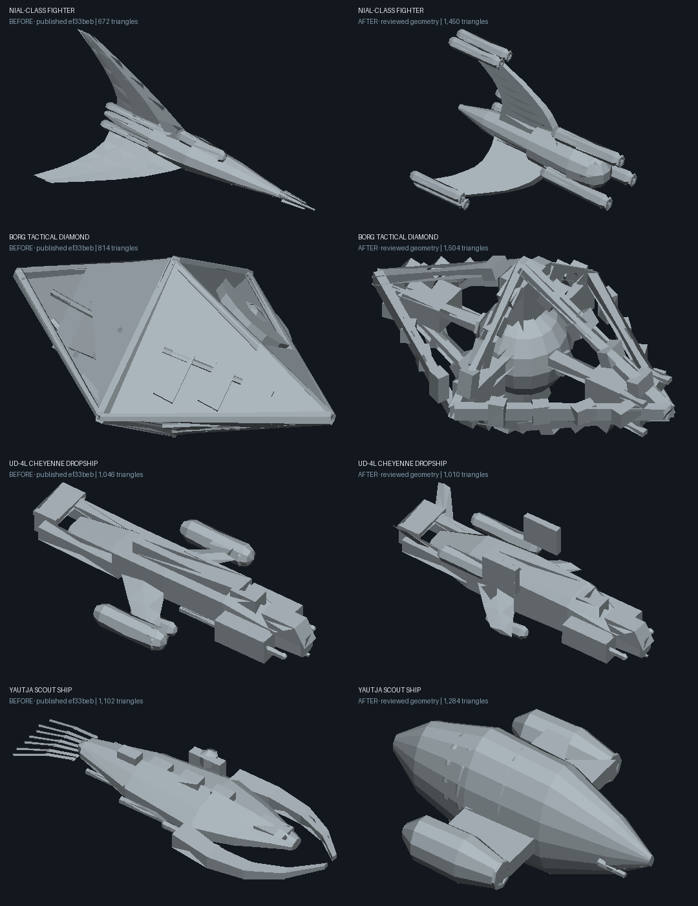
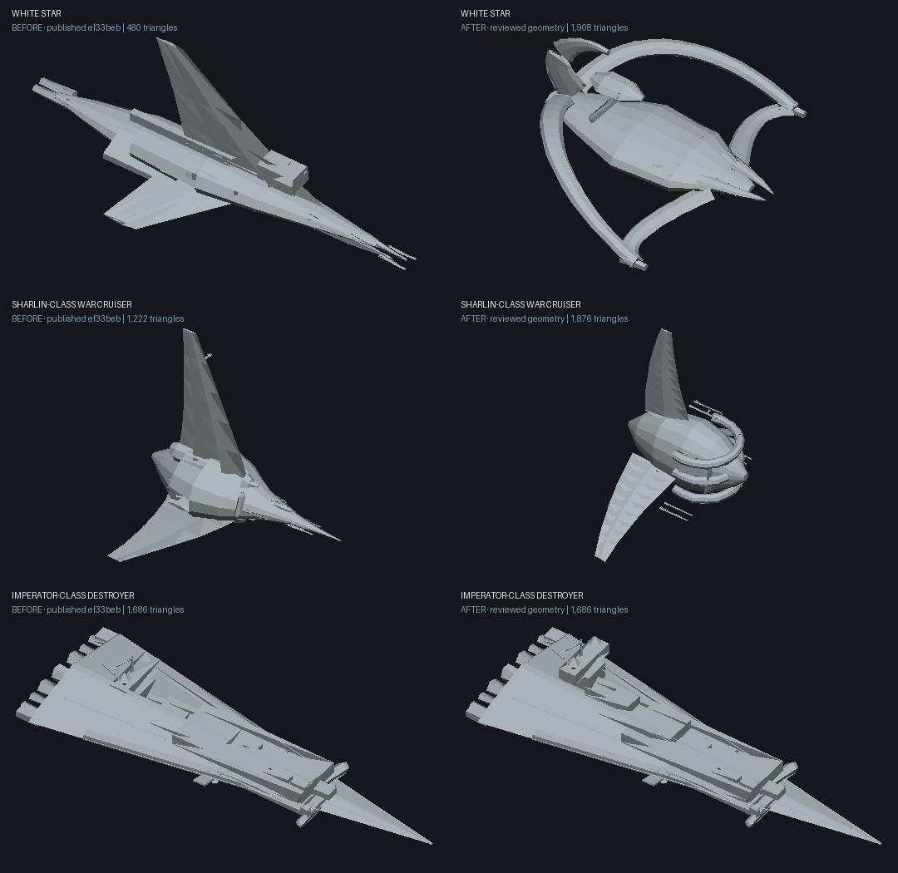

# Tribute New: fleet model review

This pass changes the procedural hulls used by **Tribute New only**. Open the [single-ship study](https://johnbr0phy.github.io/orbital-yard/tribute-new-models.html) to inspect the actual meshes and materials without starting a battle.

The strongest corrections are structural: joined Shadow carapaces, broad Engineer horseshoes, pointed Mondoshawan shells, open White Star wings, a short broad Sharlin, a blunt triad Nial, an open Borg diamond, and a rounded Yautja scout with side pods. The Cheyenne now has a deeper cargo body and raised aft engines. Imperial terraces now climb above the wedge rather than burying each other.

## Coverage and decisions

All 18 featured ships were inspected as actual-mesh clay renders, together with a representative capital from each fleet. The final isolated geometry check covers the 18 featured ships and 39 capital selections. This is a review of representative families and their shared builders, **not an exhaustive certification of every randomized variant**.

| Fleet | Assessment and action | Remaining fidelity limits |
|---|---|---|
| Yard | Original industrial fighter and modular capital forms. Retained their long central fuselage, wings and exposed machinery. | Fictional original designs; no film accuracy claim. |
| Shoal | Original segmented organic craft with trailing feelers. Retained biological silhouette and deformation. | Original species, not the Alien franchise's Engineer ships. |
| Lattice | Original angular truss/fin family. Retained geometric construction and contrasting planar surfaces. | Some generated intersections remain stylized. |
| Drift | Original asymmetric salvage craft. Retained mismatched pods, booms and sparse frames. | Deliberate kitbash aesthetic, no canonical reference. |
| Choir | Original radial sail craft. Retained thin petal arrays and small core. | Stylized sails, not a specific screen vessel. |
| Imperial | TIE Advanced silhouette retained. Raised stacked destroyer terraces; cool gray material. | Wedge details and bridge remain simplified. This does not replace every Imperial class with a production mesh. |
| Rebel | Featured Falcon's saucer, mandibles and offset cockpit retained; warmer hull finish. X-wing S-foils and gun-tip arrangement retained. | Falcon dish, cockpit and hull greebles are coarse. Official X-wing page includes a later variant; it was not treated as a precise T-65 blueprint. |
| Minbari | Rebuilt Sharlin's short broad head, curved gill rims and tall radial fins. Rebuilt Nial's blunt cockpit, curved three-wing arrangement, paired wingtip housings and three forward apertures. Blue wave finish. | Nial glazing and fin camber are simplified; Sharlin fin surfaces remain faceted. |
| Shadows | Connected central carapace replaces detached ribbon bodies. Rounded limb sections, stronger roots and longer tapered rear limbs. Rigid dark chitin finish; featured emitter moved onto the modeled aperture. | Scout/hunter variants still derive from the battlecrab anatomy, not the distinct canonical scout. Hero is intentionally battle-scaled to 180 m. |
| EarthForce | Rebuilt featured White Star with split beak, open curved wing members, raised bridge and violet finish; preserved its 258 m model length. Conventional EarthForce ships receive gray-blue finishes. | White Star is a simplified outline reconstruction. Other EarthForce classes retain their existing geometry; rotating sections are game abstractions. |
| Federation | Retained saucer, neck, secondary hull and paired nacelles; off-white finish. | Existing Enterprise is a hybrid of original-series and refit features, including a refit-style launcher. It is not an exact 1960s studio-model replica. |
| Klingon | Bird-of-Prey neck/head, shoulder engine forms and folded wings retained; green finish. | Feather plating and cockpit details are simplified; wing articulation is not newly simulated. |
| Borg | Removed closed diamond faces and invented facet eye. Built open octahedral edge framework, a suspended core, internal supports and machinery blocks. Dark metal with sparse green surface points also distinguishes cubes. | Framework is coarser than the screen vessel; core does not rotate in the static study. Existing cube detail remains procedural. |
| Mondoshawan / Fifth Element | Rebuilt pointed fluted front shell, exposed waist, aft ribs, machinery bottles and small crown projections. Bronze/patina only on Mondoshawan classes. Removed permanent legs and oversized hero barrels. | Production **maquette** was the viewed shape source; it differs from the final filming miniature. Weapon emitters and battle use are adaptations. Other convoy craft are retained. |
| USCM | Cheyenne cargo fuselage deepened; wingtip tilt-nacelles replaced with raised aft engines, folded weapon fairings and canted tail surfaces. Chin-gun attachment retained. Olive dropship and industrial gray capital finishes. | No landing-gear or weapon-pod animation. Cockpit glazing and tail mechanisms remain coarse. Sulaco reference inspected was a production-detail view, not a complete orthographic set. |
| Engineers | Rebuilt Juggernaut/Derelict as broad horseshoes with developed horn openings, transverse ribs, low dorsal blister and asymmetric secondary lobes. Removed giant domes, extraneous fleet fittings and animal-like wobble. Small patrol and large variants share the corrected anatomy. | Patrol, seeder and ark designs are invented derivatives. Geometry is not Giger's original sculpture; biomechanical detail remains procedural. Featured name still uses the game's Juggernaut class label for the Derelict interpretation. |
| Yautja | Replaced scout's mask tusks and trailing hair with broad domed shell, paired nacelles, ribbed rear hull and ventral keel, based on the 1987 vessel reference. Weapon origins follow modeled front tubes. | Gameplay scout name/scale retained; it is not claimed to be the later AVPR scout. Other Yautja capital variants are speculative composites. |
| First Ones | Reviewed featured Lorien and representative capital forms. Retained distinct families and introduced subdued finishes, with gold for Vorlon classes. | **Lowest-confidence retained geometry.** Lorien's blocky cowl and other First One forms still need better production/frame references. They must not be treated as verified screen-accurate models. |

## Visual reference provenance

References informed silhouette and major form decisions. Licensed collectibles, production maquettes and fan reproductions have different authority; none was imported as a mesh.

- **Mondoshawan:** [Propstore production art-department maquette](https://usm.propstoreauction.com/lot-details/index/catalog/287/lot/73066/Lot-75-THE-FIFTH-ELEMENT-1997-Mondoshawan-Ship-Art-Department-Maquette), actual photograph viewed. [Heritage filming-miniature listing](https://entertainment.ha.com/itm/movie-tv-memorabilia/-mondoshawan-spaceship-filming-miniature-from-the-fifth-element/a/997066-1837.s) consulted for production context; its miniature image was not successfully viewed. Support rods in maquette displays were not copied as landing legs.
- **Engineers:** [Sideshow / Hollywood Collectibles Derelict](https://www.sideshow.com/collectibles/alien-derelict-ship-hollywood-collectibles-group-906247), licensed replica photograph viewed; [Prometheus crashed Juggernaut still](https://www.avpcentral.com/images/space-jockey-ships/crashed-lv-223-juggernaut.jpg), secondary-hosted frame viewed.
- **Shadows:** [secondary-hosted battlecrab image](https://i.sstatic.net/xSreV.png) and [additional silhouette reference](https://i.pinimg.com/originals/be/e2/d2/bee2d2024275326e9c54b3ee395d454e.jpg) viewed. These are not authenticated production meshes; topology and exact proportions are inferred.
- **Minbari:** [Nial reference and model pattern by Alfred Wong](https://fantastic-plastic.com/MinbariNialFighter-CatalogPage.htm), image viewed; [Sharlin reference](https://rpggamer.org/uploaded_images/Minbwacr_lg1.jpg), secondary image viewed.
- **White Star:** [secondary-hosted firing frame](https://vignette2.wikia.nocookie.net/babylon5/images/a/a6/White_star_fires.jpg/revision/latest?cb=20070429190906), viewed for beak and open wing structure.
- **Imperial / Rebel:** official [Imperial Star Destroyer](https://www.starwars.com/databank/imperial-star-destroyer) and [X-wing](https://www.starwars.com/databank/x-wing-starfighter) images viewed. Used for major arrangement, not exact measurements.
- **Federation:** [Smithsonian Enterprise studio-model collection record](https://airandspace.si.edu/collection-objects/model-starship-enterprise-television-show-star-trek/nasm_A19740668000), primary provenance/text context. Exact photographic matching remains incomplete in this pass.
- **Klingon:** [StarTrek.com licensed Bird-of-Prey product photographs](https://www.startrek.com/news/bird-of-prey-launches-in-stores), viewed for head, neck, shoulders and folded wings.
- **Borg:** [Dark Frontier vessel frame](https://blog.trekcore.com/wp-content/uploads/2018/03/borg-diamond.jpg), viewed; [TrekCore's firsthand Eaglemoss model review](https://blog.trekcore.com/2018/03/review-eaglemoss-star-trek-cheyenne-class-and-borg-queen-ship-models/), supporting description of the skeletal structure and central core. Frame is secondary-hosted, collectible is licensed.
- **USCM:** [licensed Cheyenne model](https://www.sideshow.com/collectibles/aliens-ud-4-cheyenne-dropship-hollywood-collectibles-group-911817), photograph viewed; [production modelmaker John Lee's Aliens work](https://www.johnleemodelmaker.me/aliens.aspx), Sulaco detail photograph viewed.
- **Yautja:** [collector's claimed original Predator miniature](https://yourprops.com/light-up-predator-miniature-spaceship-original-movie-props-predator-1987-yp843349), photograph viewed. Provenance is the collector's attribution, not independently authenticated by this review.

## Rendering, attachments and validation

Fleet materials apply in the natural palette. Other palettes keep their intentional graphic treatment. Surface patterns use the existing hull shader and add no texture downloads or draw calls. The static study renders one selected mesh only when a control changes; it has no animation loop, battle simulation or forge workers.

Revised Nial and Shadow featured emitters are derived from actual final aperture coordinates. White Star origins scale with its rebuilt hull; its forward origins were corrected to the beak tips during validation. Cheyenne's chin gun remains at its modeled tip. Yautja gun origins now follow its front tubes. Noncombat screen vessels still require explicitly fictional weapon adaptations.

Completed checks, serial with conservative memory caps and short process timeouts:

- 57 real isolated meshes: finite vertices, positive bounds; maximum **5,064 triangles** at study quality 0.65.
- Three geometry/attachment regression checks passed.
- All 18 existing focused weapon tests passed, including rotating barrel alignment, fixed guns, beam continuity and Imperial green/Rebel red.
- Small Executor firing check and identical 30/120 FPS simulation-state check passed.
- Controlled fighter duel: 13 shots. Eight-fighter check: 31 shots, seven survivors. Combat implementation was not changed in this model pass.
- Actual WebGL shader compilation and material rendering inspected in the single-ship viewer. An initial inline-script parsing error was fixed; subsequent selections produced no new errors.

No full-fleet stress, long GPU soak or comprehensive balance test was run. Changed hull proportions can affect collision envelopes, mass and battle balance. Procedural flat shading, simplified glazing and coarse surface detail remain visible close up. The original five factions are intentional inventions; several franchise fleets also contain invented or hybrid variants.

## Comparison images

These are CPU clay renders of **the actual before/after triangles**, using a common viewing direction and per-cell fit. They show shape changes, not final materials, equal physical scale or screenshots from the films.

## Variety pass: new classes, variants and provenance

The variety pass (VARIETY.md) replaced "one shape at several sizes" with navies of distinct jobs. The same honesty rules as above: **canon** means seen on screen or in the franchise's own publications, **licensed** means an officially licensed game or collectible, **invented** means an original design in the fleet's own language, not a claim of canon. No mesh was imported. Lengths are battle lengths. Every class below has native weapon sockets on its own modelled barrels or apertures and appears in the ship study.

| Fleet | Class or variant | Reference and status | Model |
|---|---|---|---|
| Shadows | Shadow Fighter | Canon: small fighters carried by Shadow Vessels ([The Babylon Project, "Shadow Vessel"](https://babylon5.fandom.com/wiki/Shadow_Vessel)); the form is invented | A black dart with mandibles forward and a fan of three or five swept spines |
| Shadows | Shadow Hybrid | Canon: prototype built by a secret Earthforce division with Shadow technology and bio-organic armour ([The Babylon Project, "Shadow hybrid"](https://babylon5.fandom.com/wiki/Shadow_hybrid); *Crusade*); form invented | A long human keel the Shadow skin has grown over, a crab's cleft and spines at the bow, drive fins aft |
| Shadows | Drakh light raider, heavy raider, cruiser | Canon: the Drakh, the Shadows' servants, fly their masters' technology (*Babylon 5: A Call to Arms*, 1999; *Crusade*); the forms are invented | Forward-horned crescents of ribbed black hull around a swollen core; the heavy raider adds a second crescent and a keel; the cruiser is long and blade-nosed with a dorsal fin |
| Shadows | Carapace plans (Vessel, Hunter, Scout) | Invented | The battlecrab grows its limbs differently: long-legged, swept, grasping; the Scout is a juvenile (no hanging legs, long wings, a flat spider); the Hunter is a lean swept lancer; a third of hulls carry a scar (one limb short) |
| Engineers | Juggernaut variants: broken horn, closed ring, fused pair | Invented derivatives of the *Prometheus* (2012) Juggernaut | A horn ends in a jagged stump; the horns have met in a ring; a smaller horseshoe grown into the heart facing aft |
| Engineers | Pilot-chair gunship | Invented from the Space Jockey chair and its telescope (*Alien*, 1979; *Prometheus*) | A ribbed seat on a curved pedestal, the long barrel forward, a short horseshoe cradle |
| Engineers | Ampule dart, ampule carrier | Invented from the *Prometheus* ampule chamber | An armed urn with a ribbed stinger; a vaulted spine with its urns in racks |
| Engineers | Orrery seed vessel | Invented from the *Prometheus* orrery | A seed sphere held in four curved arms carrying lesser spheres, an open ring at its waist |
| Engineers | Temple ship | Invented from the LV-223 pyramid (*Prometheus*) | A stepped mound with a ribbed face, a crown and a mouth-gate prow |
| Engineers | Sentinel, EVA skiff (reshaped) | Invented (as before) | The Sentinel is a deep narrow tuning fork; the skiff a bean with stub horns; on main both were the Juggernaut at two sizes |
| Minbari | Tishat (reshaped) | Canon name; form invented | A lean body with two forward-raked sails and a low dorsal fin; on main it was a squashed Nial |
| Minbari | Minbari Flyer | Canon: the Minbari transport seen throughout *Babylon 5*; interpreted | A smooth flat arrowhead with a raised aft fin |
| Minbari | Leshath heavy scout | Licensed games: *Babylon 5 Wars* and *A Call to Arms* | A slim sensor hull under one tall dorsal sail and a long keel sail |
| Minbari | Sharlin in the normal capital pool | Canon | The old roll never reached it (see VARIETY.md); its refit stretch is halved to keep its proportions |
| Imperial | Carrack light cruiser | Canon: *The Empire Strikes Back* (1980) | Round-shouldered hull, a tall mid-ship tower, a heavy engine block |
| Imperial | Quasar Fire carrier | Canon: *Star Wars Rebels* (2015) | A flat hull with an open flight deck along its back and a blunt bridge block |
| EarthForce | Earth Alliance shuttle | Canon: the utility shuttle seen throughout *Babylon 5*; interpreted | Blunt box body, forward canopy, two side drive pods, a dorsal fin |
| EarthForce | Nova, Poseidon in the normal capital line | Existing class library | At battle length; the Warlock was tried and dropped (it reads as a Hyperion) |
| Federation | Type-6 shuttlecraft | Canon: *Star Trek: The Next Generation* | A blunt wedge cabin with two short nacelles slung low |
| Federation | Miranda roll bar | Canon (the Reliant carries it) | Now the class's norm (90%), since a coin toss made two plans of one class |
| Klingon | To'Duj fighter | Licensed game: *Star Trek Online* | A short-necked head over a gull wing raked back and up, cannons at the tips |
| Klingon | Vor'cha attack cruiser | Canon: *Star Trek: The Next Generation* | The existing Vor'cha form, as a normal capital |
| Klingon | F15 command refit | Existing (was named D7M) | The same hull with a command pod, named as a configuration like the F5 refits |
| Borg | Borg scout ship | Canon: *Star Trek: The Next Generation*, "I, Borg" | A small faceted wedge block |
| Borg | Assimilated shuttle | Invented, after the fleet's assimilated vessels | A donor wedge cabin half grown over |
| Borg | Tactical cube | Canon: *Star Trek: Voyager*, "Unimatrix Zero" | A cube in thick face armour, at a battle length under the crown threshold |
| Mondoshawan | NY police cruiser (reshaped) | *The Fifth Element* (1997); form invented | Long and low with tail fins, side intake pods and two guns; on main it was the cab with a light bar |
| Mondoshawan | Mangalore assault ship | Invented in the Mangalore raiders' language | A hexagonal slab with forward mandibles and dorsal spikes |
| Mondoshawan | Earth Federal battle cruiser, Fhloston-class liner as normal capitals | The fleet's own library (*The Fifth Element*) | At battle length; the liner name bank already carried sister liners |
| USCM | Covenant lander | Canon: *Alien: Covenant* (2017); interpreted | A chamfered lifting body with swept, down-tipped wings and twin aft nacelles |
| USCM | CM-88B Bison star freighter in the escort line | Canon: the Nostromo's class (*Alien*, 1979) | The fleet's existing freighter model at escort length |
| Yautja | Feral hunter's ship | Canon: *Prey* (2022), seen only briefly; interpreted | A dark lens with a dorsal spine and hooked landing claws |
| Yautja | Elder trophy barge, golden clan ship as normal capitals | The fleet's own library | At battle length, under the crown threshold |
| Originals (Yard, Shoal, Lattice, Drift) | Capital-band hulls | Original designs | Capital jobs forge the fleet's own one-off designs (up to eight from derived seeds) and keep the first that is naturally capital length (118 m or more); failing that, the longest is grown to 118–240 m. The line keeps the fleet's language, and its long types rather than a small craft blown up |
